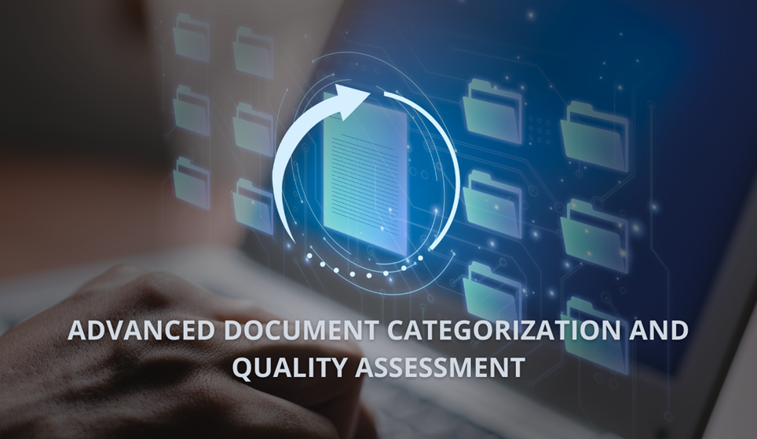
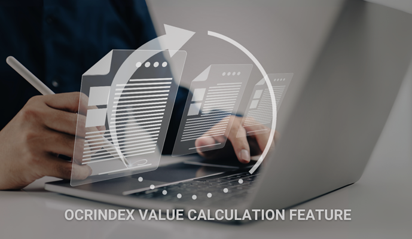
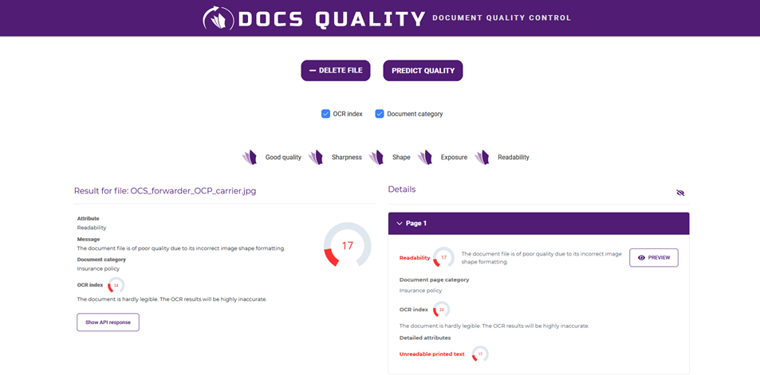
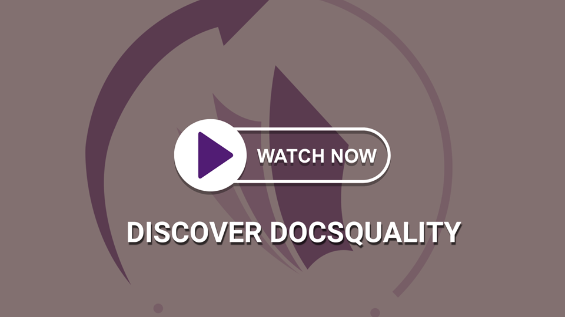

# DocsQuality

## Document Quality Control

**DocsQuality allows you to verify document quality before inserting it into a digital repository.
The software immediately highlights issues, for example, with email attachments, signaling that the system should not
accept the document into the workflow at this stage.
DocsQuality allows you to automatically verify the quality of all electronic documents in the entire organization.**

## Features

DocsQuality assesses factors in real-time such as **readability** and **clarity**, as well as **detecting issues**
including:

- sharpness,
- exposure,
- unreadable handwriting,
- unreadable printed text,
- shape,
- OCR index.

**OCRIndex** is a numerical measure indicating how well OCR (Optical Character Recognition) software can read text from
electronic documents, including images or scanned writings. It considers the image quality, particularly font
characteristics, and detects document defects such as compression, blurring, contrast, etc. A higher OCRIndex suggests a
higher likelihood of accurate character recognition.

## Categorization

DocsQuality **identifies various types of documents**, such as invoices, insurance, or transport documents.
The application performs text extraction using an advanced OCR text recognition system and then assigns the file to the
appropriate category.

**DocsQuality will analyze and categorize the following types of documents:**

- invoice
- CMR
- consignment note
- delivery note
- payment confirmation
- agreement
- insurance policy

## How to interpret the results?

DocsQuality analyzes a series of attributes, assigning documents a score on a scale from 0 to 100. The results are
expressed on a four-point scale.

**DocsQuality** uses advanced analytical business intelligence functions that detect undesirable features in documents.
**It uses AI and ML methods trained on over 10 000 real business documents.**

For more detailed information, visit the [DocsQuality](https://docsquality.com/) website or our YouTube channel.

